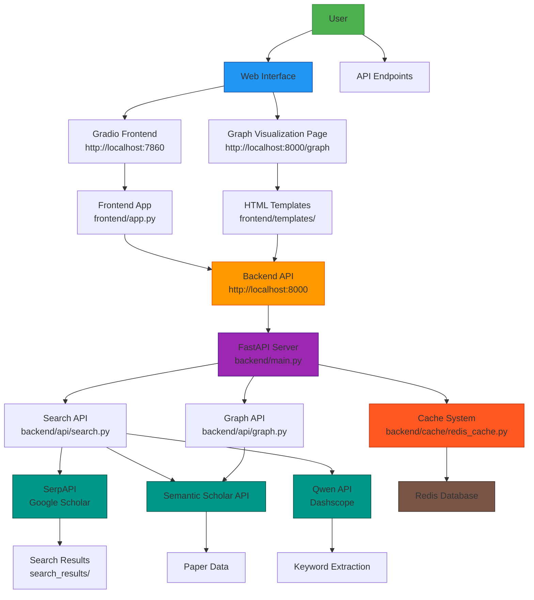

# Scholar Assistant

A powerful academic research tool that helps users explore academic papers, visualize citation networks, and save/export findings.

## Features

1. **Academic Paper Search**:
   - Search for papers using Google Scholar API
   - Retrieve detailed information about papers including titles, abstracts, authors, and citations
   - Combine results from Google Scholar and Semantic Scholar APIs for comprehensive information
   - Support for Chinese queries with automatic English keyword extraction using Qwen API

2. **Knowledge Graph Visualization**:
   - Visualize citation and reference networks using D3.js (browser-based) and NetworkX (Python-based)
   - Node size represents citation count
   - Node color intensity represents paper age (darker = newer)
   - Interactive graph visualization in the browser

3. **Qwen Integration**:
   - Natural language processing capabilities
   - Summarization of research topics
   - Answering questions about academic papers
   - Integration with Qwen API for advanced language processing

4. **Export Functionality**:
   - Save and export search results in multiple formats (JSON, CSV, etc.)
   - Export knowledge graphs in JSON and GraphML formats
   - Export options available for both search results and graph data

5. **Caching System**:
   - Redis-based caching for frequently accessed paper information
   - Configurable cache expiration
   - Improved performance for common queries through cached results

6. **Additional Features**:
   - User-friendly interface with Gradio
   - Custom HTML/CSS styling for enhanced user experience
   - Command-line interface for advanced users
   - Comprehensive documentation and help system

## Prerequisites

Before you begin, ensure you have the following:

1. **API Keys**:
   - [SerpAPI Key](https://serpapi.com/) for Google Scholar access
   - [Dashscope API Key](https://dashscope.aliyuncs.com/) for Qwen API access

2. **System Requirements**:
   - Docker (recommended) OR Python 3.7+
   - Redis server (included in Docker setup)

## Installation

### Option 1: Using Docker (Recommended)

1. **Clone the repository**:
   ```bash
   git clone <repository-url>
   cd scholar-assistant
   ```

2. **Create .env file** with your API keys:
   ```bash
   cp .env.example .env
   ```

3. **Edit .env file** and add your API keys:
   ```bash
   nano .env
   ```
   Replace:
   - `your_serpapi_key_here` with your actual SerpAPI key
   - `your_dashscope_api_key_here` with your actual Dashscope (Qwen) API key

4. **Start the application using Docker Compose**:
   ```bash
   docker-compose up -d
   ```

5. **Access the application**:
   - Open your browser and go to: http://localhost:7860

### Option 2: Manual Installation

1. **Clone the repository**:
   ```bash
   git clone <repository-url>
   cd scholar-assistant
   ```

2. **Make the setup script executable**:
   ```bash
   chmod +x setup_env.sh
   ```

3. **Run the setup script**:
   ```bash
   ./setup_env.sh
   ```

4. **Add API keys**:
   - Edit the `.env` file and add your SerpAPI and Dashscope API keys

5. **Access the application**:
   - Open your browser and go to: http://localhost:7860

## Usage Instructions

### Web Interface (Gradio)

1. **Search for papers**:
   - Type "search [topic]" to search for academic papers
   - Example: "search machine learning in healthcare"
   - The system will return the most relevant papers with titles, abstracts, authors, and citation counts

2. **Visualize knowledge graphs**:
   - Type "graph [paper title]" to visualize a knowledge graph for a specific paper
   - Example: "graph Deep Learning for Medical Image Analysis"
   - The system will show an interactive graph of citations and references

3. **Get help**:
   - Type "help" to see all available commands and features

4. **Export data**:
   - Use the export links in the application to download search results or graph data
   - Export options available in multiple formats including JSON

### Direct Web Access

You can also access the web interfaces directly:

1. **Gradio Frontend**: http://localhost:7860
2. **FastAPI Backend**: http://localhost:8000
3. **Graph Visualization Page**: http://localhost:8000/graph

### Command Line Interface

The setup script provides additional functionality for managing the application:

```bash
# Start the application (if already configured)
./setup_env.sh

# Stop the application
./setup_env.sh stop

# Restart the application
./setup_env.sh restart
```

## API Endpoints

### Search API
- **GET /search/papers**
  - Query parameters:
    - `query`: Search query
    - `max_results`: Maximum number of results to return (default: 5)
  - Returns: List of papers with titles, abstracts, authors, citation counts, and other information

### Graph API
- **GET /graph/paper/{paper_id}**
  - Path parameter:
    - `paper_id`: ID of the paper to retrieve
  - Returns: Detailed information about a specific paper including title, abstract, year, authors, and citation count

- **GET /graph/citations/{paper_id}**
  - Path parameter:
    - `paper_id`: ID of the paper to retrieve citations for
  - Returns: Citation network for the paper including nodes and links data

- **GET /graph/references/{paper_id}**
  - Path parameter:
    - `paper_id`: ID of the paper to retrieve references for
  - Returns: Reference network for the paper including nodes and links data

- **GET /api/export/search/{query}**
  - Path parameter:
    - `query`: Search query to export results for
  - Returns: JSON data of search results for the query

- **GET /api/export/graph/{paper_id}**
  - Path parameter:
    - `paper_id`: ID of the paper to export graph data for
  - Returns: JSON data containing both citations and references for the paper

### Graph Visualization
- **GET /graph**
  - Returns: Interactive graph visualization page

## Technology Stack

- **Backend**: Python FastAPI
  - API endpoints for paper search and graph data
  - Redis integration for caching
  - Semantic Scholar API integration

- **Frontend**: Gradio with custom HTML/CSS
  - Interactive chat interface
  - Knowledge graph visualization
  - Command-line interface for advanced users

- **Visualization**: D3.js and NetworkX
  - Interactive browser-based graph visualization
  - Network analysis and layout using NetworkX

- **Caching**: Redis
  - Caching of search results and graph data
  - Configurable cache expiration

- **APIs**: 
  - Google Scholar (via SerpAPI)
  - Semantic Scholar
  - Qwen (via Dashscope)

## Architecture Overview

The following diagram illustrates the architecture of the Scholar Assistant application and the interactions between its components:



### Component Descriptions

1. **User Interface Layer**:
   - **Gradio Frontend**: Main chat interface for searching papers and visualizing graphs
   - **Graph Visualization Page**: Dedicated page for interactive knowledge graph exploration

2. **Backend API Layer**:
   - **FastAPI Server**: Core backend service that handles all API requests
   - **Search API**: Handles paper search functionality with integration to multiple academic databases
   - **Graph API**: Manages citation and reference network data for visualization
   - **Cache System**: Redis-based caching to improve performance and reduce API calls

3. **External Services**:
   - **SerpAPI**: Provides access to Google Scholar search results
   - **Semantic Scholar API**: Supplies detailed academic paper information
   - **Qwen API**: Enables natural language processing for query understanding

4. **Data Storage**:
   - **Redis Database**: Caching layer for frequently accessed paper information
   - **Search Results**: Local storage of search results in JSON format

## Project Structure

```
scholar-assistant/
├── backend/              # FastAPI backend
│   ├── api/              # API endpoints
│   ├── cache/            # Redis caching
│   ├── config.py         # Configuration
│   └── main.py           # Main application
├── frontend/             # Gradio frontend
│   ├── static/           # Static files (CSS)
│   ├── templates/        # HTML templates
│   └── app.py            # Frontend application
├── search_results/       # Search result storage
├── .env.example          # Example environment variables
├── .gitignore            # Git ignore file
├── Dockerfile            # Docker configuration
├── docker-compose.yml    # Docker Compose configuration
├── README.md             # This file
├── requirements.txt      # Python dependencies
└── setup_env.sh          # Setup script
```

## Troubleshooting

1. **Port conflicts**:
   - If ports 8000 or 7860 are already in use, stop the conflicting processes or modify the docker-compose.yml file

2. **API key issues**:
   - Ensure your API keys are correctly set in the .env file
   - Check that your SerpAPI and Dashscope accounts have sufficient credits

3. **Docker issues**:
   - Make sure Docker is running: `sudo systemctl start docker`
   - Check Docker logs: `docker-compose logs`

4. **Service management**:
   - Stop services: `./setup_env.sh stop`
   - Restart services: `./setup_env.sh restart`
   - Check logs: `tail -f backend.log` or `tail -f frontend.log`

## Contributing

Contributions are welcome! Please read the contributing guidelines before submitting pull requests.

## License

[Add your license information here]

## Acknowledgments

This project uses several third-party libraries and APIs:
- FastAPI for the backend API
- Gradio for the frontend interface
- D3.js for graph visualization
- NetworkX for graph analysis
- Redis for caching
- SerpAPI for Google Scholar access
- Dashscope for Qwen API access
- Semantic Scholar API for academic data
